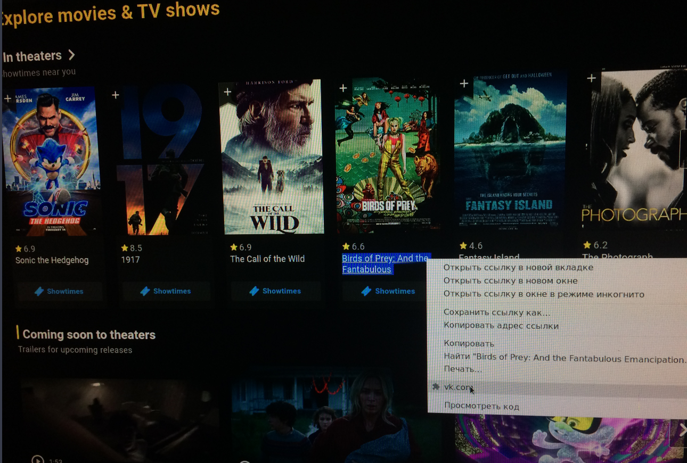

# Play
This is a Chrome extension that allows you to find a highlighted movie.


## Install
* Install chrome-extension, go to `chrome://extensions/`
* Set token [vkontakte](https://oauth.vk.com/authorize?client_id=YOU_CLIENT_ID&scope=1073737727&redirect_uri=https://oauth.vk.com/blank.html&display=page&response_type=token&revoke=1) to .env file
* Build docker image
```bash
docker build -t play .
```
* Run created container
```bash
docker run -d -p 7531:7531 --env-file .env --restart unless-stopped --name play play
```
